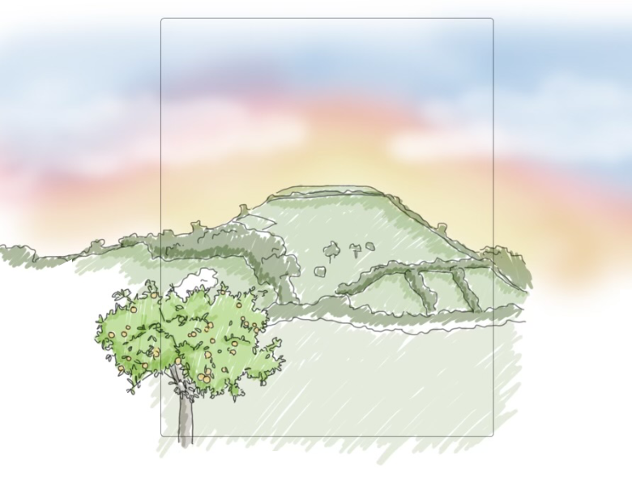

<!doctype html>
<html lang="en">
  <head>
    <meta charset="utf-8">
    <meta name="viewport" content="width=device-width, initial-scale=1">
    <meta name="description" content="Dimpsey Somerset Gin">
    <meta name="author" content="Tommy">
    <title>Dimpsey Somerset Gin</title>

    <!-- Bootstrap core CSS -->
    <link href="../node_modules/bootstrap/dist/css/bootstrap.min.css" rel="stylesheet">
    
    <!-- Custom styles for this template -->
    <link href="dimpsey.css" rel="stylesheet">
  </head>
  <body data-bs-spy="scroll" data-bs-target="#main-nav" data-bs-offset="0" tabindex="0">
    
    <header>
      <nav id="main-nav" class="navbar navbar-expand-md navbar-dark fixed-top bg-dark">
        

          <a class="navbar-brand" href="#">Dimpsey Somerset Gin</a>
          <button class="navbar-toggler" type="button" data-bs-toggle="collapse" data-bs-target="#navbarCollapse" aria-controls="navbarCollapse" aria-expanded="false" aria-label="Toggle navigation">
            
          </button>
          

            <ul class="navbar-nav me-auto mb-2 mb-md-0">
              <li class="nav-item">
                <a class="nav-link" href="#theGin">The Gin</a>
              </li>
              <li class="nav-item">
                <a class="nav-link" href="#whereItsMade">Where it's Made</a>
              </li>
            </ul>
          

        

      </nav>
    </header>

    <main>

      

          
      

      

        

          <blockquote class="blockquote text-center">
            
Distilled in copper pot stills just before Dimpsey - that’s old Somerset for sunset - at the foot of the Mendip Hills,  
              using locally foraged botanicals and Cheddar spring water,   this is Somerset Gin.

          </blockquote>
        

        

        

          

            

              <label>
                <input type="radio" name="test" value="small" onchange="changeImage('seventy')" checked>
                
                70cl
              </label>

              <label>
                <input type="radio" name="test" value="big" onchange="changeImage('five')">
                
                5cl
              </label>
            
<!-- /.col-lg-2 thumbnails -->

            

              
              
            
<!-- /.col-lg-6 main-image -->

            

              

                

                  
<strong>Nose</strong>

                  
Fragrant juniper, grapefruit & cinnamon

                

                

                  
<strong>Palette</strong>

                  
Smooth & Full-bodied, balanced with grapefruit and mandarin peel freshness

                

                

                  
<strong>Finish</strong>

                  
A long extra dry finish, smooth enough to enjoy on the rocks!

                

              

              
Our gin comes packaged with a lovely little bag of dried petals that can be used to compliment the organic,
                hand-foraged botanicals that we use. 

              
Best enjoyed as a gin and tonic. Fill a glass with lots of ice, top with a premium tonic and a curl of pink grapefruit
                or mandarin peel to garnish.

              <form>
                

                  <input class="form-check-input" type="radio" name="inlineRadioOptions" id="seventyClRadio" value="seventyCl" onchange="changeImage('seventy')" checked>
                  <label class="form-check-label" for="seventyClRadio"><strong>£35</strong> <small>70cl</small></label>
                

                

                  <input class="form-check-input" type="radio" name="inlineRadioOptions" id="fiveClRadio" value="fiveCl" onchange="changeImage('five')">
                  <label class="form-check-label" for="fiveClRadio"><strong>£6</strong> <small>5cl</small></label>
                

              </form>
              
Free UK shipping on orders over £50

              <button type="submit" class="btn btn-primary mb-2">ADD TO BASKET</button>
              <button type="submit" class="btn btn-secondary mb-2">BUY NOW</button>
            
<!-- /.col-lg-4 description -->
          
<!-- /.row -->
        
<!-- /.marketing -->

        

          

          

            

              <h2 class="featurette-heading">Check out our distillery. It's where the magic happens.</h2>
              
Dimpsey Somerset Gin is lovingly hand-crafted in our converted barn, the Still Shed Distillery.

              
Our distillery's location is as rural as the taste of our Somerset gin, nested amongst brambles and fields, Dimpsey Somerset Gin is distilled in
                our copper pot stills, using only the finest, locally foraged botanicals - most of which we grow ourselves!

              
If you'd like to know more about us or our distillery, check out the Still Shed website!

            
<!-- /.col-lg-6 distillery-description -->

            

              
            

          

          

        
<!-- /.distillery -->

      <!-- FOOTER -->
      <footer class="container">
        
<a href="#">Back to top</a>

        
&copy; 2021 Still Shed Distillery Limited &middot; <a href="#">Still Shed</a> &middot; <a href="#">Privacy</a>

      </footer>
    </main>

    

    

  </body>
</html>
